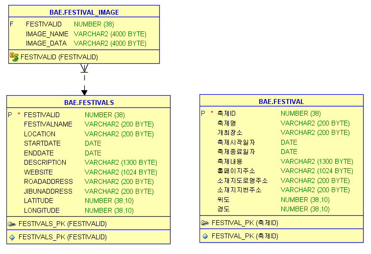

## 목차

### -팀원소개
    
 |  이름  | 백엔드(주요 프레임워크) | 개발환경 | DataBase | 프론트엔드 
|--------|---------------------|-------------------------------|-----------------------------|-----------------------------|
| 김정승 |    nodejs, Nginx, python    |    IntelliJ IDEA , vim , Pycharm     | oracle 11g | HTML, javascript, css, React|
| 노가현 |    nodejs, Nginx, python    |    IntelliJ IDEA , vim , Pycharm     | oracle 11g | HTML, javascript, css, React|
| 배호진 |    nodejs, Nginx, python    |    IntelliJ IDEA , vim , Pycharm     | oracle 11g | HTML, javascript, css, React|
| 배은지 |    nodejs, Nginx, python    |    IntelliJ IDEA , vim , Pycharm     | oracle 11g | HTML, javascript, css, React|

[AWS 실행환경](http://3.143.252.195:3000/mainPage)

---
    
### 프로젝트개요
+ 기간 : 2024.03.29(금) ~ 2024.05.08(수)
+ 주제 :  대한민국 구석구석 축제, 공연, 맛집, 시장을 소개하며 국내 여행 코스를 제공, 유저들끼리 소통할 수 있는 웹 서비스 제작
+ 선정이유 : 기존 한공광관공사에서 운영하고 있는 사이트(대한민국 구석구석)을 분석하여, 보완할 부분을 찾아서 제작 선정
+ (기존)사이트 보완점 : 주변 시장, 맛집도 함께 제공하여 사용자들과 소통할 수 있는 게시판 구성

---
### -페르소나
    * 주요 페르소나
     - 유아동반 부부 -
        + (필요 요소)
            1. 어린이메뉴가 있는 음식점
            2. 키즈존/수유방
            3. 유모차 대여
            4. 키즈동반가능카페
            5. 어린이 혜택(ex. 3세미만 유아 무료)
            6. 포토스팟(인스타 업로드)
            7. 주차공간
            8. 어린이 체험이 가능한 축제/전시 선호

     - 반려견 동반 부부 -
        + (필요 요소)
            1. 반려견 동반이 가느한 축제/전시 선호
            2. 카페/음식점 후기
            3. 인근 반려견 위탁 가능 장소 확인
             
    * 페르소나
    
     - 20대 남성 or 여성 -
        + (필요 요소)
            1. 지역 액티비티
            2. 맛집
            3. 주차장
            4. 휴게소
            5. 지역 랜드마크
            6. 숙소 근처 마트
            7. 로컬 음식
            8. 가성비, 할인혜택
            9. 감성카페

     - 50대 이상 부부 -
        + (필요 요소)
            1. 개방감 있는 카페 또는 음식점
            2. 어렵지 않고 한눈에 보이는 여행 루틴
            3. 부부동반 여행시 필요한 단체석 구비 음식점
            4. 제철음식
            5. 화장실
---

### 담당업무

* 김정승 -  
    + 데이터베이스 구성 및 제작 / 공공데이터 입력
    + 데이터베이스를 활용한 정보제공 페이지 제작 및 정렬기능 구현
    + 유저 참여를 위한 CRUD가 가능한 게시판 구현
    + 페이지 템플릿 구현
    + chatbot 구현
    + 회원가입, 로그인 등 페이지 기본 기능 구현
    + 필요한 실데이터 수집 및 import
    + 실시간 날씨 데이터 
  
* 노가현 -  
    + 데이터 조사 및 웹 서비스 기획
    + 지역, 축제 (상세페이지) 구현(UI는 PC 및 모바일 기기에서 동일 한 UI유지)
    + 필요한 실데이터 수집 및 import
    + 지도 데이터 제공
    + 지역별 데이터로 원하는 위치에 따른 데이터 제공

* 배호진 -
    + 게시판 BackEnd 제작 담당
    + 데이터베이스 구성 및 제작 / 공공데이터 입력
    + 필요한 실데이터 수집 및 import
    + 여행추천 화면 구현((UI는 PC 및 모바일 기기에서 동일 한 UI유지)
    + 회원가입, 로그인 등 기본 기능 백엔드 구현

* 배은지 - 
  +  데이터조사 및 웹서비스 기획
  +  메인화면 구현(UI는 PC 및 모바일 기기에서 동일 한 UI유지)
  +  실시간 onpeAPI를 활용한 차트 구현
  +  필요한 실데이터 수집 및 import
  +  시장,축제,맛집 데이터 필터링 기능 제공
    
---

### DB 테이블

---

### 주요기능 
* 김정승 -
  + 공공 API, 지도 API, Weather API 등을 활용한 정보 제공 기능
  + 이미지와 comment 를 남길 수 있는 게시판 기능
  + 검색 및 페이지 안내를 하는 chatbot 기능
  + 페이지 이동없이 javascript를 통한 DB 와의 통신기능
  + 사용자와 상호 작용하며 질문에 응답하고 필요한 정보를 제공하는 챗봇
  + 사용자가 회원으로 가입하고 로그인할 수 있는 기능을 포함한 기본적인 사용자 관리 시스템을 구현
  + 프로젝트에 필요한 실제 데이터를 수집하고, 이를 데이터베이스에 입력

* 노가현 -  
  + 데이터 정제 후 DB에 적재하여 데이터 활용 
  + 축제 및 전시 장소와 주변 시장/맛집 간 직선거리계산
  + kakao map API를 활용한 축제 및 전시,사용자에게 지도를 제공하여 지역과 축제의 위치를 시각적으로 표시
  + 지역별 카테고리 및 시장/맛집 페이징 처리   

* 배호진 -  
  +  로그인, 로그아웃, 회원가입 기능 구현
  +  oracle be table 생성
  +  게시판 페이징 처리 및 검색 기능
  +  자유게시판 기능 구현  CRUD
  +  댓글, 대댓글  CRUD
  +  여행추천 화면 구현(버튼 별 주제에 맞는 축제를 추천, 로그인시 성향에 맞는 랜덤 추천)

* 배은지 -  
  +  페이지가 렌더링될 때 축제, 시장, 맛집 정보를 서버, Axios를 사용하여 API 호출
  +  OpenAPI를 사용하여 실시간 데이터를 가져와서 차트로 시각화
  +  사용자에게 보여줄 실제 데이터를 수집,애플리케이션에 import
  +  사용자가 시장, 축제, 맛집 중 하데이터를 필터링하여 원하는 결과를 얻을 수 있도록 기능을 제공

### -향후과제
    + 프로젝트 과제
     - 전체 -
         사용자의 다양한 연령을 고려한 사이트 한글화
         지역 특산물 추가구현
         숙소 추천 기능
         여행유형별 추천

    + 조원별 개인 과제
    
     - 김정승 -  
         Main Page 컨텐츠 추가 및 추가 기능 구현
         chatbot 기능 추가 
         정보 제공 페이지 정리
         
     - 노가현 -     
         전체적인 UI(디테일) 개선
         맛집/시장 이미지 추가
         축제와 전시 정보 이미지 슬라이더 추가
         직선거리가 아닌 kakaomap API를 활용한 길찾기 기능 추가
 
     - 배호진 - 
         버튼 별 주제에 맞는 데이터를 불러와 축제 추천 구현
         축제, 맛집, 관광지 이미지 추가 및 버튼에 이미지 연동
         게시판 좋아요 구현

     - 배은지 - 
         전체적인 UI(디테일) 개선
         차트 성능 업데이트
         키워드를 통한 추천 데이터 기능
         

